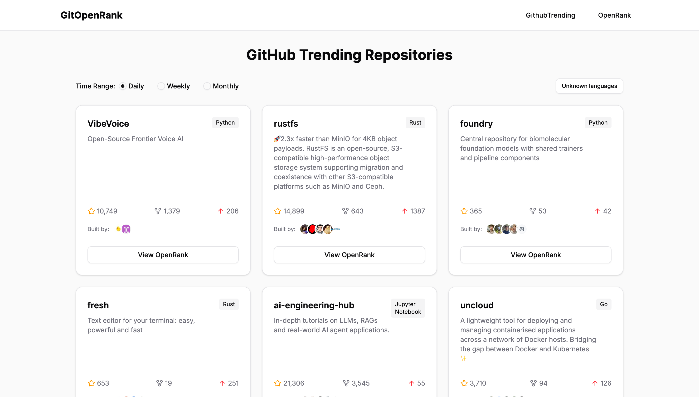
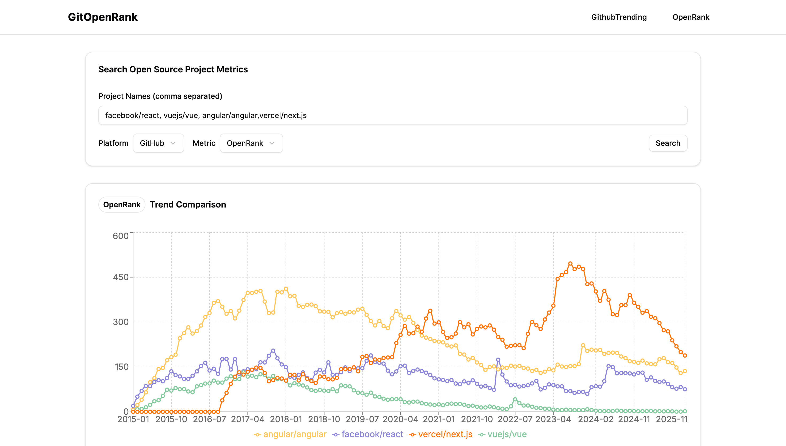
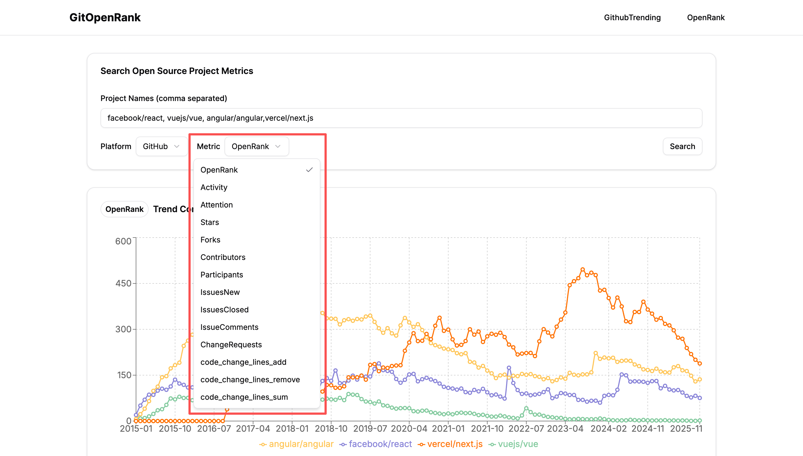

# GOR
GitOpenRank (GOR), Github/Gitlab Trending show OpenRank score

- @author: pangzhangdeng
- @email: coshpr@163.com
- @wechat: coshpr

[[app-web-view]](https://openrank-2025.vercel.app/trending)(deploy in vecel)

### Features
Github Trending show OpenRank score

multi repos OpenRank score comparison

support multi metrics

### TeckStack
- Nextjs
- Tailwindcss
- OpenDigger(api)
- Shacn-ui

### Comptition
- [“OpenRank杯”开源数字生态分析与应用创新赛](https://competition.openatom.tech/competitionInfo?id=0a5e298718189f3e889e18507064323d#heading-0-0)

### Thanks
- [OpenDigger](https://open-digger.cn/docs/user-docs/metrics/metrics-usage-guide)
- [Github-trending](https://github.com/doforce/github-trending?tab=readme-ov-file)
- [Vercel](https://vercel.com/)
- [realfavicongenerator](https://realfavicongenerator.net/logo-maker)
