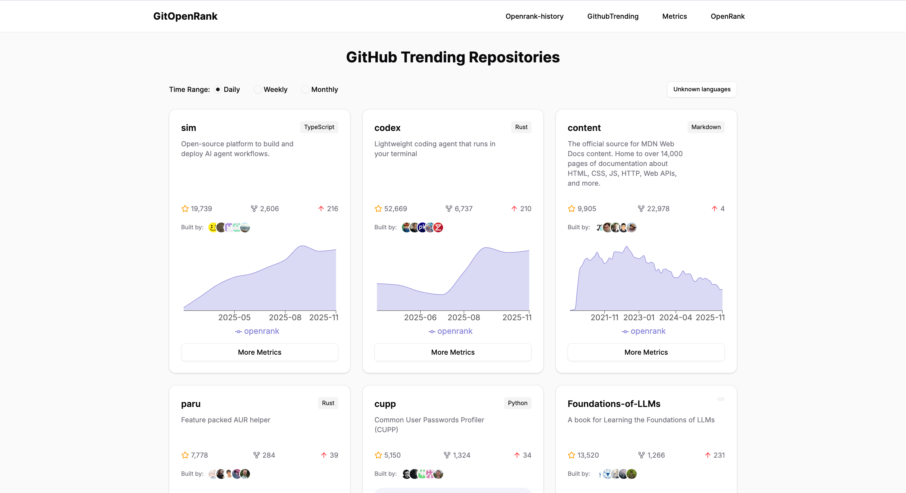
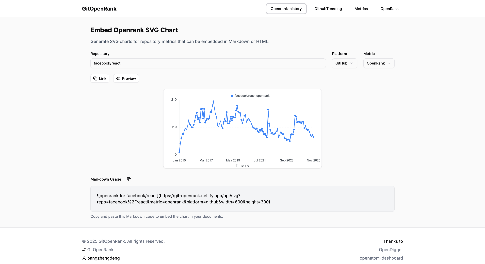
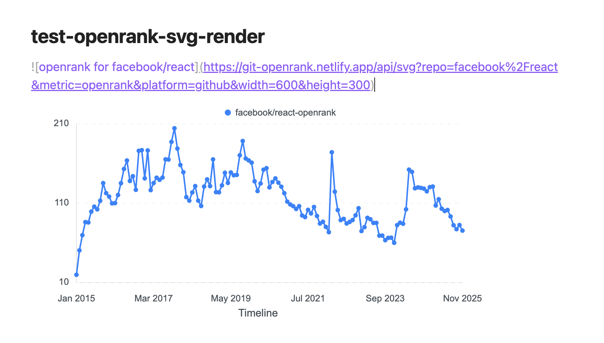
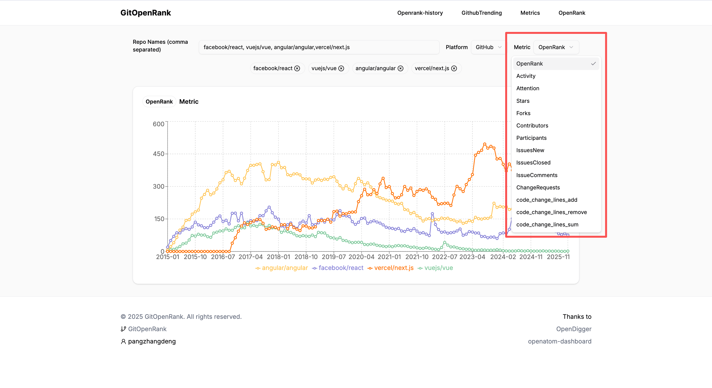
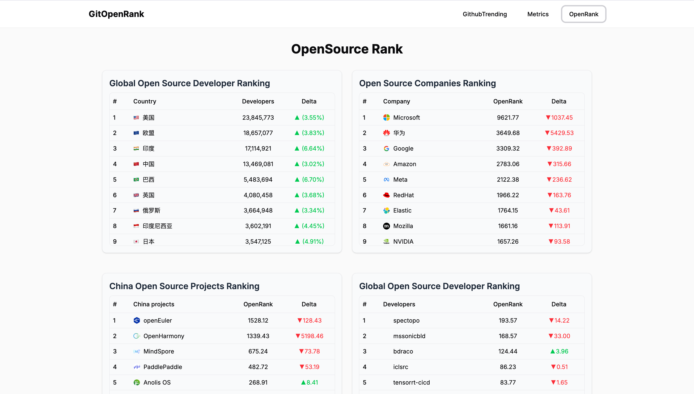

# GitOpenRank (GOR)

[](https://nextjs.org/)
[](LICENSE)


GitOpenRank (GOR) 是一个可视化平台，用于展示 GitHub 趋势项目中的 OpenRank 分数，并提供多种开源项目数据分析功能。

## 预览地址

- [git-openrank.vercel.app](https://git-openrank.vercel.app/)
- [git-openrank.netlify.app](https://git-openrank.netlify.app/)

## 核心功能

### 1. GitHub 趋势项目 OpenRank 可视化
实时显示 GitHub 趋势项目中的 OpenRank 分数，帮助开发者更好地评估项目的影响力和活跃度。



### 2. SVG 图表嵌入
生成可嵌入到任何地方的 SVG 图表，方便在 README、博客或其他文档中展示项目数据。



#### Markdown 使用方式：
```markdown

```



### 3. 多项目指标对比
支持多个仓库间的指标对比，帮助开发者选择合适的开源项目。



### 4. 开源项目排行榜
提供全球开源生态的各项排名数据：

- 国家/地区开源贡献排名
- 开源企业排名
- 中国开源项目排名
- 全球开发者排名



## 技术栈

- [Next.js 16](https://nextjs.org/) - React 框架
- [TypeScript](https://www.typescriptlang.org/) - 类型安全的 JavaScript
- [Tailwind CSS](https://tailwindcss.com/) - 实用优先的 CSS 框架
- [Shadcn UI](https://ui.shadcn.com/) - React 组件库
- [Recharts](https://recharts.org/) - 图表组件库
- [OpenDigger API](https://open-digger.cn/docs/user-docs/metrics/metrics-usage-guide) - 数据来源

## 快速开始

### 环境要求

- Node.js >= 18
- npm 或 yarn

### 安装步骤

```bash
# 克隆项目
git clone https://github.com/pangzhangdeng/openrank.git

# 进入项目目录
cd openrank/ui

# 安装依赖
npm install

# 启动开发服务器
npm run dev
```

访问 http://localhost:3000 查看应用。

### 构建部署

```bash
# 构建生产版本
npm run build

# 启动生产服务器
npm start
```

## 应用场景

本项目在 ["OpenRank杯"开源数字生态分析与应用创新赛](https://competition.openatom.tech/competitionInfo?id=0a5e298718189f3e889e18507064323d#heading-0-0) 中参赛并展示了其价值。

## 致谢

特别感谢以下项目和组织的支持：

- [OpenDigger](https://open-digger.cn/docs/user-docs/metrics/metrics-usage-guide) - 提供开源生态数据
- [Github-trending](https://github.com/doforce/github-trending?tab=readme-ov-file) - GitHub 趋势数据源
- [Vercel](https://vercel.com/) - 项目托管平台
- [Netlify](https://www.netlify.com/) - 项目托管平台
- [通义灵码](https://lingma.aliyun.com/lingma) - AI 编程助手

## 联系方式

- 作者：pangzhangdeng
- 邮箱：coshpr@163.com
- 微信：coshpr