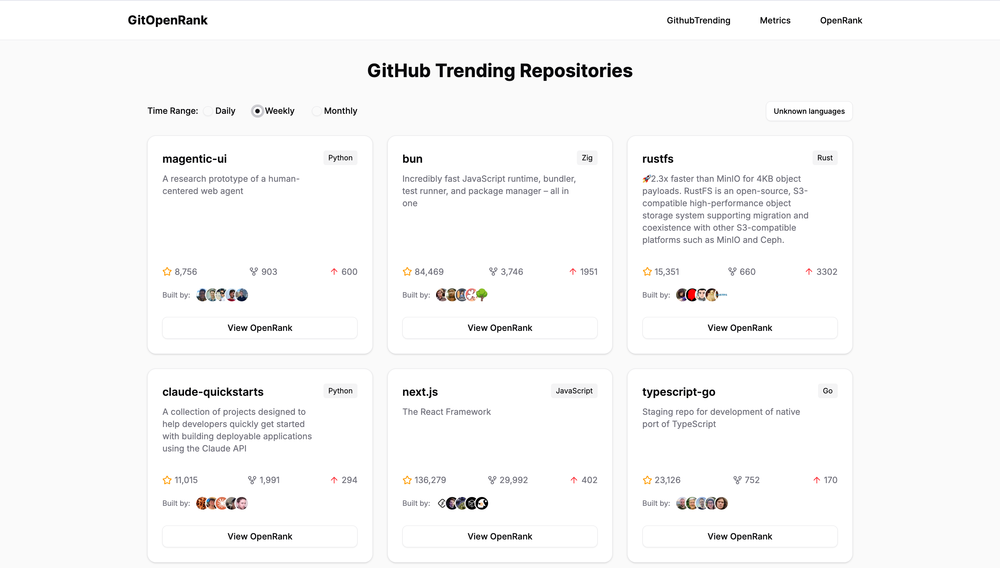
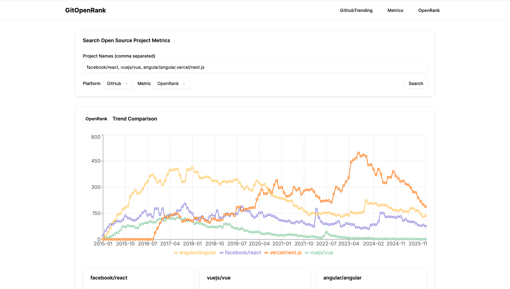
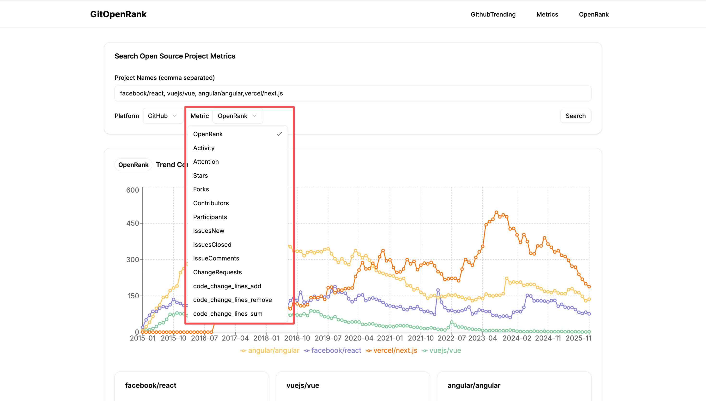

# GOR
GitOpenRank (GOR), Github Trending show OpenRank score

- @author: pangzhangdeng
- @email: coshpr@163.com
- @wechat: coshpr

### Preview
+ [git-openrank.vercel.app](https://git-openrank.vercel.app/) (deploy in vecel)
+ [git-openrank.netlify.app](https://git-openrank.netlify.app/) (deploy in netlify)

### Features
1. Github trending show OpenRank score

2. multi-repos openrank score comparison

3. support multi-metrics

4. open source projects openrank dashboard

### TeckStack
- Nextjs
- Tailwindcss
- OpenDigger(api)
- Shacn-ui

### Comptition
- [“OpenRank杯”开源数字生态分析与应用创新赛](https://competition.openatom.tech/competitionInfo?id=0a5e298718189f3e889e18507064323d#heading-0-0)

### Thanks
- [OpenDigger](https://open-digger.cn/docs/user-docs/metrics/metrics-usage-guide)
- [Github-trending](https://github.com/doforce/github-trending?tab=readme-ov-file)
- [Vercel](https://vercel.com/)
- [Netlify](https://www.netlify.com/)
- [realfavicongenerator](https://realfavicongenerator.net/logo-maker)
- [Tongyi Lingma](https://lingma.aliyun.com/lingma) (vscode plugin)
- [openatom-dashboard](https://openatom-dashboard.x-lab.info/)
